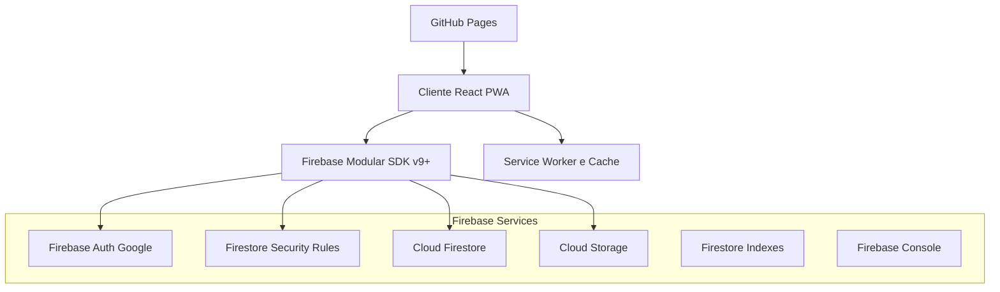

# Arquitetura do Servidor — pbta.app

## 5. Arquitetura do Servidor

Como o Firebase é um BaaS (Backend as a Service), não há servidor próprio. O front-end (React + Vite, PWA) é hospedado estaticamente (GitHub Pages), e todo backend é provido pelos serviços do Firebase descritos no documento de requisitos.

## Responsabilidades por Serviço

- `Firebase Auth (Google)`: autenticação exclusiva; identifica modo MASTER/PLAYER via e-mail fixo e coleção `masters`.
- `Cloud Firestore`: armazenamento de campanhas, personagens, moves, rolagens, sessões e notas.
- `Firestore Security Rules`: regras permissivas para usuários autenticados; controle fino implementado na aplicação (ACL interna).
- `Cloud Storage`: arquivos de mídia opcionais (imagens de personagens, assets de campanha).
- `Service Worker / Cache`: PWA offline-aware; cache de assets; exibição de modo offline e sincronização ao reconectar.
- `Firestore Indexes`: índices para consultas eficientes (por `campaignId`, ordenação por `date`, etc.).
- `GitHub Pages`: hospedagem do bundle estático gerado pelo Vite; deploy via GitHub Actions.

## Fluxos Principais

- Login Google: usuário autentica; app determina modo MASTER/PLAYER e carrega o dashboard correspondente.
- Acesso a dados: todas as operações passam pelo SDK modular; ACL interna evita ações fora do escopo do modo do usuário.
- Links públicos: leitura sem login usando `publicShareId` para fichas/personagens do mestre compartilháveis.
- Rolagens PBTA: gravação de histórico em `rolls`; jogador vê apenas suas rolagens; mestre vê todas.
- Offline-aware: interface detecta desconexão; bloqueia ações dependentes do Firestore; sincroniza ao reconectar.

## Mapeamento de Coleções (Firestore)

- `masters`: governança de mestres (uid, email, isSuperMaster).
- `campaigns`: metadados da campanha, plot, players convidados, ruleSet.
- `characters`: fichas de jogadores e PDMs (`isNPC`, `isPrivateToMaster`, `publicShareId`).
- `moves`: movimentos PBTA por campanha.
- `rolls`: histórico de rolagens (2d6, bônus/penalidades, timestamps).
- `sessions`: sessões com `date`, `summary`, `gmNotes`, `publicNotes`.
- `notes`: notas por escopo (global/character/session) e autor.

## Observações de Segurança e ACL

- Regras Firestore permitem leitura/escrita para `request.auth != null`; validações de permissão são aplicadas na camada de aplicação.
- Mestre inicial reconhecido automaticamente por e-mail; demais mestres via coleção `masters`.
- Rotas públicas não exigem autenticação e são somente leitura.