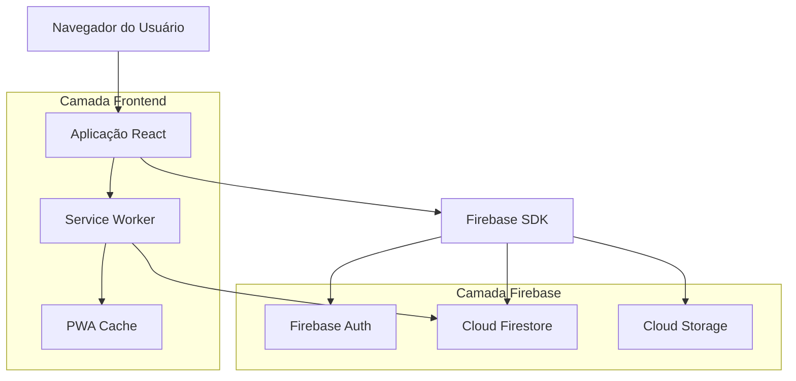

# Arquitetura do Sistema — pbta.app

## 1. Arquitetura do Sistema

### Camadas

- Frontend: React + Vite, PWA, Service Worker e cache offline; UI mobile-first e adaptativa.
- Firebase: Auth (Google), Firestore (dados de campanhas, fichas, moves, sessões, rolagens, notas), Storage (mídia).
- Segurança: regras Firestore permitem usuários autenticados; ACL fina pela aplicação (modo PLAYER/MASTER).

### Fluxos

- Login Google determina modo PLAYER/MASTER e carrega dashboards específicos.
- CRUDs operam via SDK modular; validações de acesso por serviços da aplicação.
- Offline-aware: assets em cache, fallback de página offline, persistência do Firestore e sincronização ao reconectar.
- Links públicos: leitura sem login por `publicShareId` para fichas e PDMs.