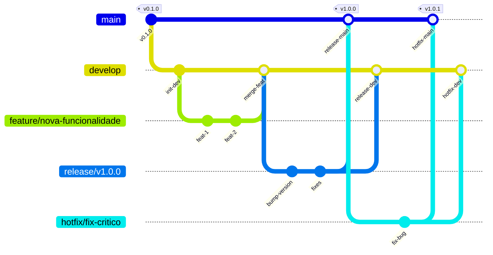

# Guia de Gitflow do Projeto PBTA App

Este documento descreve o fluxo de trabalho (workflow) que utilizamos neste projeto, baseado no modelo **Gitflow**. O objetivo é manter a organização, estabilidade e um histórico limpo.

## 📊 Diagrama Visual



## 🌳 Ramos Principais (Branches)

Existem dois ramos eternos no repositório:

### 1. `main` (Produção)
- **O que é:** Representa o código que está em produção.
- **Regra de Ouro:** NUNCA faça commits diretos na `main`.
- **Estado:** Sempre estável e pronto para uso.

### 2. `develop` (Desenvolvimento)
- **O que é:** Onde o código para o próximo lançamento é integrado.
- **Origem:** Sai da `main`.
- **Uso:** É a base para criar novas funcionalidades.

---

## 🍃 Ramos de Suporte

Estes ramos têm tempo de vida curto e servem para propósitos específicos.

### 1. Feature Branches (`feature/`)
- **Para que serve:** Desenvolver uma nova funcionalidade ou fazer ajustes.
- **Origem:** `develop`
- **Destino:** `develop` (via Pull Request)
- **Convenção de Nome:** `feature/nome-descritivo-da-tarefa`
  - Ex: `feature/login-page`, `feature/ajuste-css-header`

### 2. Hotfix Branches (`hotfix/`)
- **Para que serve:** Corrigir bugs críticos que já estão em produção (na `main`) e não podem esperar.
- **Origem:** `main`
- **Destino:** `main` E `develop`
- **Convenção de Nome:** `hotfix/descricao-do-bug`

### 3. Release Branches (`release/`)
- **Para que serve:** Preparar uma nova versão para produção (polimento final, atualização de versão).
- **Origem:** `develop`
- **Destino:** `main` E `develop`
- **Convenção de Nome:** `release/v1.0.0`

---

## 🚀 Fluxo de Trabalho Passo a Passo

### Como começar uma nova tarefa (Feature)

1. **Vá para a develop e atualize:**
   ```bash
   git checkout develop
   git pull origin develop
   ```

2. **Crie sua branch de feature:**
   ```bash
   git checkout -b feature/minha-nova-funcionalidade
   ```

3. **Trabalhe:**
   - Faça seus códigos, testes e commits normalmente nesta branch.

4. **Suba suas alterações:**
   ```bash
   git push -u origin feature/minha-nova-funcionalidade
   ```

5. **Finalize:**
   - Vá no GitHub e abra um **Pull Request (PR)** da sua branch `feature/...` para a `develop`.
   - Após aprovado e mergeado, a funcionalidade estará na `develop`.

---

## ⚠️ Resumo das Regras

1. **Desenvolvimento** acontece em branches `feature/`.
2. **Integração** acontece na `develop`.
3. **Produção** vive na `main`.
4. **Pull Requests** são obrigatórios para levar código para `develop` ou `main`.
